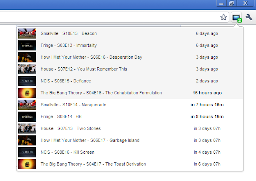
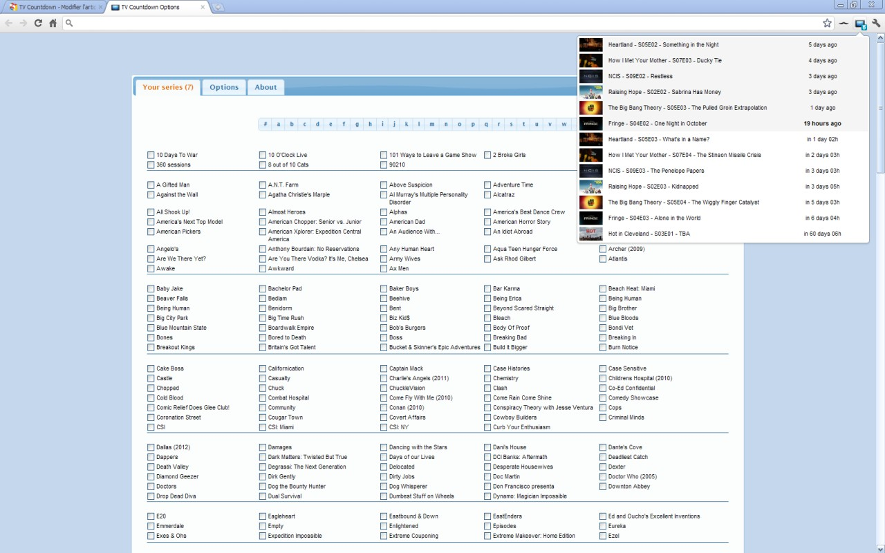

# TV Countdown Extension

  <!-- Standard -->
  
  

 

Count down the days, hours, minutes and seconds left until your favorite shows air ! 

# Description

You don't want to miss your favorite series ?

This extension counts down the days, hours, minutes and seconds left until your favorite shows air. 
Just select your series in "Options", and click on the extension's icon. 

- How I got all these TV show thumbnails ?
  - See [get_images.py](get_images.py)
  - Google Image + Get first image + Resize

- Where the data came from ?
  - [https://www.tvcountdown.com/](https://www.tvcountdown.com/)

- Does the extension still work ?
  - No, it needs some updates to comply Chrome Web Store Policy.
  - Last version 3.0.0.3 (09/14)

# Screenshots

<table>
    <tr>
        <td vlign="center"></td>
        <td vlign="center"></td>
    </tr>
</table>

